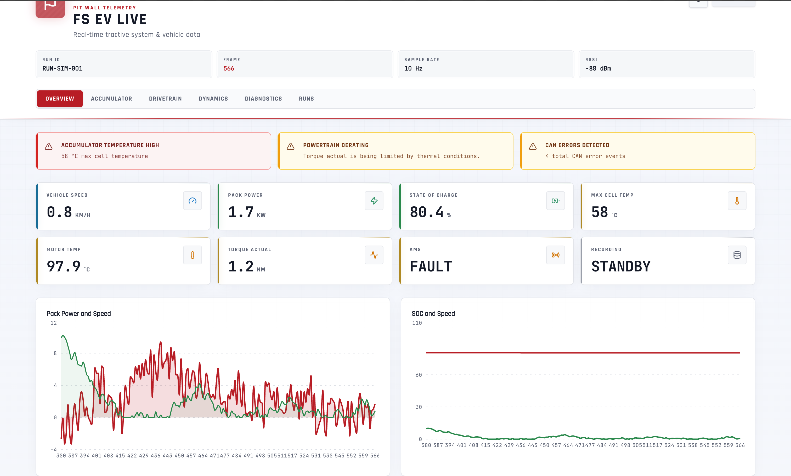
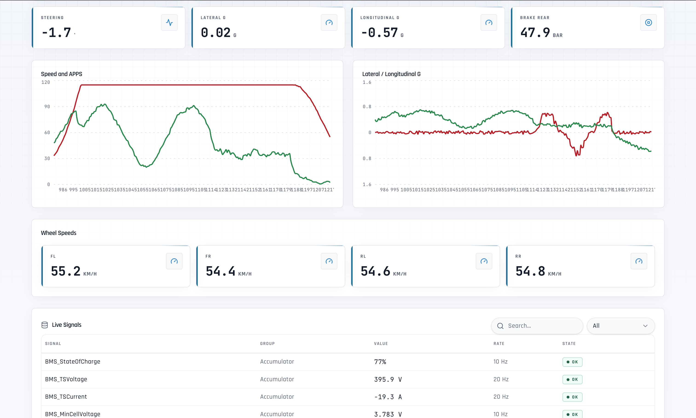

# Formula Student EV — Live Telemetry Platform

Real-time telemetry platform for a Formula Student electric race car. Streams simulated vehicle data over WebSocket, visualises it in a live dashboard, and supports session recording, replay, and post-run analysis.

## Screenshots

### Overview



### Vehicle dynamics



---

## Tech stack

| Layer    | Technologies                                                    |
| -------- | --------------------------------------------------------------- |
| Frontend | React 18, TypeScript, Vite, Tailwind CSS v4, Recharts, Radix UI |
| Backend  | Python 3.12+, FastAPI, Uvicorn, Pydantic v2, WebSockets         |
| Data     | JSONL run logs, structured metadata files                       |
| Testing  | Pytest, Ruff, TypeScript strict mode                            |
| DevOps   | Docker Compose, GitHub Actions CI, Makefile                     |

---

## Architecture

```text
┌─────────────────────────────────────────────────────────────────────────┐
│  Telemetry Simulator (driving-state machine)                            │
│  States: PRECHARGING → READY_TO_DRIVE → ACCELERATING → CORNERING       │
│          → BRAKING → COOLDOWN (→ rare FAULT)                            │
│  Correlated signals: APPS → torque → current → voltage sag → heating   │
└────────────────────────────────┬────────────────────────────────────────┘
                                 │ TelemetryFrame @ SAMPLE_HZ
                                 ▼
┌─────────────────────────────────────────────────────────────────────────┐
│  FastAPI Backend                                                        │
│  ├─ GET  /health                 System status + uptime                 │
│  ├─ WS   /ws/telemetry           Live frame stream                      │
│  ├─ WS   /ws/replay/{run_id}     Recorded session playback              │
│  ├─ POST /api/recording/start    Begin JSONL capture                    │
│  ├─ POST /api/recording/stop     End capture + finalize metadata        │
│  ├─ GET  /api/recording/status   Current recording state                │
│  ├─ GET  /api/runs               List recorded sessions                 │
│  ├─ GET  /api/runs/{run_id}      Run metadata + frame count             │
│  └─ GET  /api/runs/{id}/download ZIP archive of run data                │
└────────────────────────────────┬────────────────────────────────────────┘
                                 │ WebSocket JSON frames
                                 ▼
┌─────────────────────────────────────────────────────────────────────────┐
│  React Dashboard                                                        │
│  ├─ Overview          Speed, power, SOC, temps, safety, recording       │
│  ├─ Accumulator       Cell voltages, temperatures, gauges, charts       │
│  ├─ Drivetrain        Torque, RPM, inverter state, thermal derating     │
│  ├─ Vehicle Dynamics  G-forces, wheel speeds, driver inputs, yaw        │
│  ├─ Diagnostics       WS status, CAN load, RSSI, CPU, storage          │
│  └─ Runs              Record, list, inspect, replay, download           │
└─────────────────────────────────────────────────────────────────────────┘
```

---

## Quick start

### Prerequisites

- Python **3.12+**
- Node.js **20+** (22 recommended)
- (Optional) Docker and Docker Compose

### Install

```bash
make install
```

### Run locally

```bash
# Terminal 1 — backend
cd backend
uvicorn app.main:app --reload --host 0.0.0.0 --port 8000

# Terminal 2 — frontend
cd frontend
npm run dev
```

Backend: http://localhost:8000/health
Dashboard: http://localhost:5173

### Docker Compose

```bash
docker compose up --build
```

---

## API

| Method | Path                          | Description                                           |
| ------ | ----------------------------- | ----------------------------------------------------- |
| `GET`  | `/health`                     | System health, sample rate, uptime, connected clients |
| `WS`   | `/ws/telemetry`               | Live telemetry frame stream                           |
| `WS`   | `/ws/replay/{run_id}`         | Replay recorded run at original sample rate           |
| `GET`  | `/api/recording/status`       | Current recording state                               |
| `POST` | `/api/recording/start`        | Begin recording (accepts driver, event_type, notes)   |
| `POST` | `/api/recording/stop`         | Stop recording and finalize metadata                  |
| `GET`  | `/api/runs`                   | List all recorded runs                                |
| `GET`  | `/api/runs/{run_id}`          | Run metadata and frame count                          |
| `GET`  | `/api/runs/{run_id}/download` | Download run as ZIP                                   |
| `GET`  | `/api/runs/{run_id}/jsonl`    | Download raw JSONL                                    |

---

## Telemetry frame

```json
{
  "t": 142,
  "timestamp": "2026-05-23T01:45:12.345678+00:00",
  "run_id": "RUN-SIM-001",
  "mode": "MOCK",
  "driving_state": "ACCELERATING",
  "battery": {
    "soc": 78.4,
    "ts_voltage": 388.2,
    "ts_current": 152.3,
    "min_cell_voltage": 3.741,
    "max_cell_voltage": 3.782,
    "avg_cell_voltage": 3.762,
    "max_cell_temp": 34.2,
    "min_cell_temp": 30.8,
    "temp_spread": 3.4,
    "cell_delta_mv": 41.0,
    "pack_power_kw": 59.1
  },
  "drivetrain": {
    "motor_rpm": 4680,
    "torque_request": 142.5,
    "torque_actual": 138.2,
    "inverter_temp": 48.3,
    "motor_temp": 52.1,
    "dc_bus_voltage": 388.2,
    "derating": false,
    "inverter_state": "ENABLED"
  },
  "vehicle": {
    "speed": 62.4,
    "apps": 68.2,
    "brake_front": 0.0,
    "brake_rear": 0.0,
    "steering_angle": 3.2,
    "yaw_rate": 8.4,
    "lat_g": 0.38,
    "long_g": 0.52,
    "wheel_speed_fl": 62.1,
    "wheel_speed_fr": 62.8,
    "wheel_speed_rl": 63.2,
    "wheel_speed_rr": 63.5
  },
  "safety": {
    "ams": "OK",
    "imd": "OK",
    "sdc": "CLOSED",
    "precharge": "COMPLETE",
    "air_positive": "CLOSED",
    "air_negative": "CLOSED",
    "rtd": "ON",
    "active_faults": 0
  },
  "logger": {
    "recording": true,
    "storage_gb_free": 112.8,
    "cpu_temp": 48.2,
    "dropped_frames": 0,
    "can_bus_load": 28.4,
    "can_errors": 0,
    "telemetry_rssi": -54.0,
    "packet_loss": 0.12
  }
}
```

Schema: `backend/app/schemas/telemetry.py`

---

## Simulator

The telemetry simulator is a driving-state machine that cycles through track phases:

```
PRECHARGING → READY_TO_DRIVE → ACCELERATING → CORNERING → BRAKING → COOLDOWN → (repeat)
```

Rare `FAULT` events interrupt the cycle temporarily.

Signals are correlated, not random:

- APPS → torque request → torque actual (with lag)
- Torque → current draw → voltage sag → pack power
- Sustained power → cell/inverter/motor heating → derating
- Braking → speed reduction; cornering → steering/yaw/lateral G
- SOC decreases under load
- Wheel speeds differ under traction slip
- CAN load and packet loss correlate with activity

---

## Recording

Start/stop via the dashboard UI or API:

```bash
curl -X POST http://localhost:8000/api/recording/start \
  -H "Content-Type: application/json" \
  -d '{"driver": "Alex Kim", "event_type": "endurance", "notes": "Session 3"}'

curl -X POST http://localhost:8000/api/recording/stop
```

Runs are stored in `RUN_DATA_DIR` (default `backend/data/runs/`):

```
RUN-20260523-014512-A3B7C1.jsonl       ← one frame per line
RUN-20260523-014512-A3B7C1.meta.json   ← metadata (driver, event, times, frame count)
```

Replay in dashboard or via WebSocket at `/ws/replay/{run_id}` (closes with code `4200` on completion).

---

## Testing

```bash
make test
```

| Test file           | What it covers                                             |
| ------------------- | ---------------------------------------------------------- |
| `test_imports.py`   | Module structure and import paths                          |
| `test_simulator.py` | Frame validity, signal bounds, correlations, state cycling |
| `test_recorder.py`  | JSONL persistence, metadata, path traversal safety         |
| `test_api.py`       | Health, recording lifecycle, runs, WebSocket frames        |

---

## Environment variables

### Backend (`backend/.env`)

| Variable         | Default                     | Description           |
| ---------------- | --------------------------- | --------------------- |
| `TELEMETRY_MODE` | `mock`                      | Telemetry source      |
| `SAMPLE_HZ`      | `10`                        | Frames per second     |
| `RUN_DATA_DIR`   | `./data/runs`               | Run storage directory |
| `CORS_ORIGINS`   | `http://localhost:5173,...` | Allowed origins       |

### Frontend (`frontend/.env`)

| Variable                | Default                            | Description      |
| ----------------------- | ---------------------------------- | ---------------- |
| `VITE_TELEMETRY_WS_URL` | `ws://localhost:8000/ws/telemetry` | WebSocket URL    |
| `VITE_BACKEND_HTTP_URL` | `http://localhost:8000`            | Backend HTTP URL |

---

## Project structure

```text
backend/
  app/
    api/routes/        Route handlers
    core/              Config, state, dependencies
    schemas/           Pydantic models
    services/
      simulator/       Driving-state machine
      telemetry/       WS hub, broadcast, replay
      recorder.py      JSONL recording
    utils/             Helpers
    main.py            App factory
  tests/

frontend/
  src/
    features/
      dashboard/       Tab views
      runs/            Recording panel
    components/        Shared UI
    hooks/             useTelemetry, useTheme
    lib/               Types, config, utilities

docker-compose.yml
Makefile
.github/workflows/ci.yml
```

---

## Troubleshooting

| Issue                           | Fix                                                |
| ------------------------------- | -------------------------------------------------- |
| Dashboard stuck on "Connecting" | Start backend first; check `VITE_TELEMETRY_WS_URL` |
| CORS errors                     | Add your frontend origin to `CORS_ORIGINS`         |
| Empty runs list                 | Record a session first                             |
| `npm run build` fails           | Use Node 20+; run `npm install`                    |
| Tests fail on import            | Run pytest from `backend/` with deps installed     |
